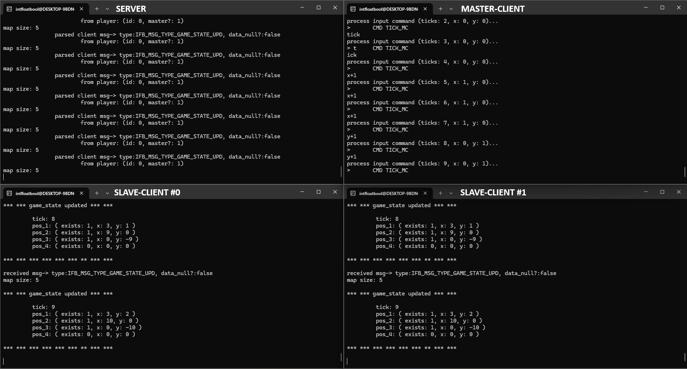

# Event-Driven Master-Client Relay (CLI, C)

[**ENGLISH Version**](./README_ENG.md)

Небольшой учебный **сетевой CLI-проект на чистом C**, демонстрирующий **event-driven модель** взаимодействия клиентов через сервер-ретранслятор с **Master-Client Authority**.

Проект создавался как практическое упражнение по:
- сетевому программированию на C,
- работе с ENet (UDP + надежная доставка),
- сериализации и десериализации сообщений через MsgPack,
- потокам и синхронизации,
- проектированию архитектуры клиент ↔ сервер без real-time цикла.

---

## 🎯 Идея проекта



- Есть **сервер-ретранслятор** (relay), который **не содержит игровой логики**
- Первый подключившийся клиент становится **Master**
- Master:
  - хранит состояние мира
  - обрабатывает input от других клиентов
  - рассылает обновлённое состояние всем
- Остальные клиенты (**Slaves**):
  - отправляют только свои input-команды
  - применяют состояние, полученное от Master

Модель **не real-time**, а **событийная**:
- обновление мира происходит по команде `tick`
- идеально подходит для обучения, отладки и понимания сетевых паттернов

---

**Ключевые принципы:**
- сервер не интерпретирует данные
- сервер лишь ретранслирует сообщения
- вся логика сосредоточена в Master-клиенте
- единый протокол сообщений для клиента и сервера

---

## 📂 Структура проекта

```

.
├── Makefile
├── README.md
└── src
    ├── client.c              # CLI клиент (Master / Slave)
    ├── server.c              # Relay-сервер
    ├── protocol_msg.h        # Общий сетевой протокол
    ├── help_func/            # Вспомогательные функции
    └── thread_safe/          # Потокобезопасные структуры

````

---

## 🔌 Используемые технологии

- **C (C17)**
- **ENet** — UDP-библиотека с надежной доставкой
- **MsgPack-C** — бинарная сериализация сообщений
- **POSIX Threads (pthreads)** — многопоточность
- **Linux / WSL2**

Проект ориентирован на Unix-подобные системы.

---

## 📡 Протокол сообщений

Все сообщения описаны в `protocol_msg.h`.

Примеры типов сообщений:
- регистрация клиента
- назначение Master
- input клиента (намерение изменить состояние)
- snapshot состояния мира

Сериализация выполняется через **MsgPack**, что:
- избавляет от ручного фрейминга
- делает протокол расширяемым
- позволяет использовать одинаковые структуры на клиенте и сервере

---

## 🧵 Потоки и синхронизация

- Сетевой цикл ENet работает в отдельном потоке
- CLI-ввод работает независимо
- Обмен между потоками реализован через потокобезопасные очереди
- Исключены race-condition при работе с ENet

---

## ▶️ Сборка

### Зависимости

Установить:
```bash
sudo apt install libenet-dev libmsgpack-dev
````

### Сборка

```bash
make
```

Будут собраны:

* `server`
* `client`

---

## 🚀 Запуск

### Сервер

```bash
./server
```

### Клиенты

```bash
./client <IP_сервера> 7777
```

Можно запускать:

* несколько клиентов на одной машине
* клиентов на разных ПК в одной LAN / Wi-Fi сети

---

## 🕹️ Управление (CLI)

Примеры команд в клиенте:

```
tick
x+
x-
y+
y-
```

* `tick` — инициирует обновление мира (Master)
* остальные команды отправляют input Master-клиенту

---

## 📚 Для чего этот проект

Проект создавался **не как игра**, а как:

* учебный стенд по сетевому программированию
* основа для перехода к:

  * real-time синхронизации
  * prediction / reconciliation
  * авторитарному серверу
* материал для статей и образовательных проектов

---

